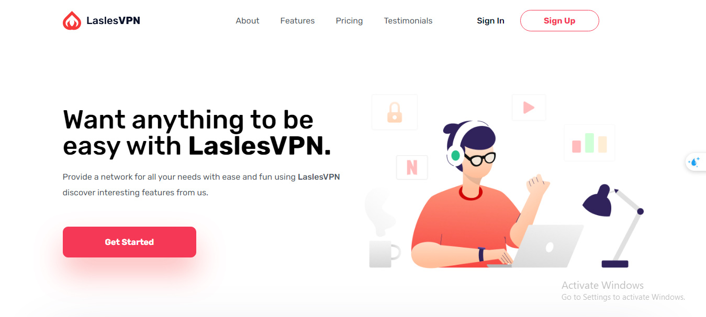

# LaslesVPN Landing Page

Welcome to the LaslesVPN landing page project! 🌐 This application is more than just a static webpage—it's a showcase of modern web design and development techniques, powered by responsive layouts, smooth animations, and intuitive interactions. This project isn't just about aesthetics; it represents a step-by-step learning journey in SCSS mastery, BEM methodology, and structured JavaScript for a seamless user experience.

As a developer committed to delivering high-quality, scalable projects, this landing page demonstrates my dedication to creating a pixel-perfect UI, while incorporating maintainable and scalable code. I am excited to share the skills and insights gained from building this project and look forward to applying them in future collaborations!

## Technologies
- **HTML5**: The foundational structure for semantic, accessible markup.
- **SCSS (Sass)**: For writing clean, modular, and reusable styles, leveraging variables, mixins, and functions.
- **JavaScript (ES6)**: For dynamic interactions and animations, including scroll effects and number count animations.
- **BEM Methodology**: For scalable, readable, and maintainable class naming.
- **Responsive Design**: Ensuring optimal experiences across all devices, using a mobile-first approach.

## Features
1. **Responsive Design** 📱: Enjoy a seamless browsing experience across devices, from mobile to desktop.
2. **Fancy Animations** 🎉: Smooth, eye-catching transitions for elements as users scroll and interact, including a counter animation and header animations.
3. **BEM Methodology** 🛠️: Structured class names make the code easy to understand, style, and maintain.
4. **SCSS Proficiency** 🎨: A modular approach to SCSS, leveraging mixins, functions, and variables to keep styles organized and DRY.
5. **JavaScript Interactivity** ⚙️: Custom animations, scroll-triggered events, and smooth transitions give users a delightful experience.

## Preview
Check out this landing page in action  [here](https://ali-fadel-profile.github.io/vpn-landingPage/).

